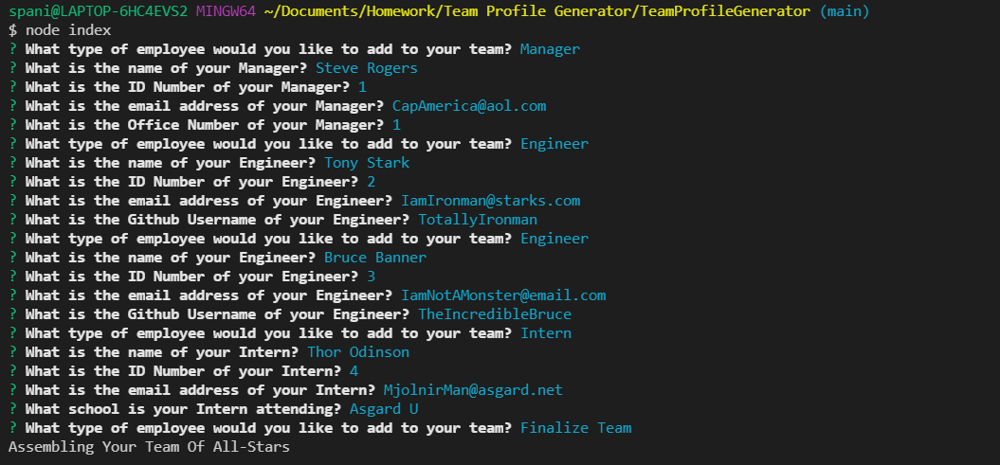
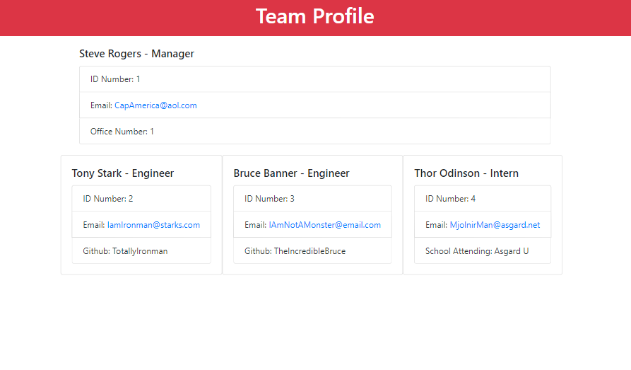

# <Homework Week 10: Team Profile Generator>  
  
    

  ## Description  
  ### What was your motivation?  
    - To create an easy to use team profile generator that can help speed up the process of gathering your team's information.  
  ### Why did you build this project?  
    - To automate and speed up the process of assembling your team and putting all their information in one place.  
  ### What problem does it solve?  
    - This project allows the user to gather all relevant information about a team in one easy to read format.  
  ### What did you learn making this project?  
    - I learned introductions to NPM, Inquirer, JEST, and running tests to ensure the program functions correctly.  
   
  ## Table of Contents 
  - [Installation](#installation)  
  - [Usage](#usage)  
  - [Credits](#credits)  
  - [License](#license)  

  ## Installation  
  ### The application will be invoked by using the following command:  
      node index.js  

  ## Usage  
    
    

      
  ## Credits  
  Contact me at: [email](poo328@my.utsa.edu "email")  
  Github can be found at: [Github](https://github.com/MrG105 "Github")  
    
  ## License
      Licensed under the MIT license  
  ---
